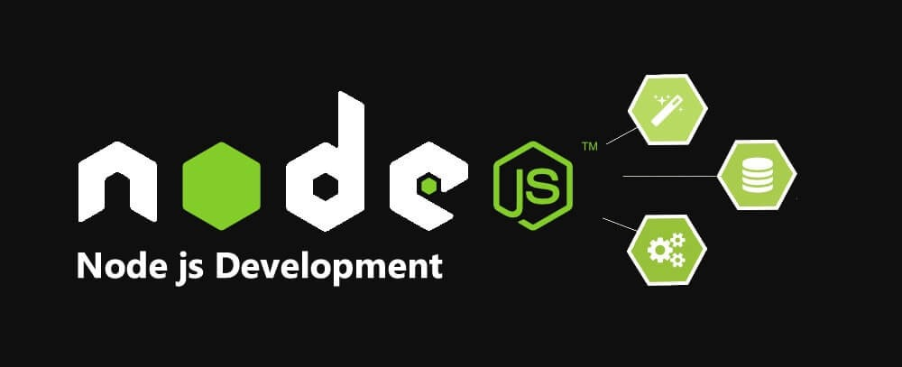

# Sudy of Node.Js

This is a study of Node.Js programming language.
Course available in [Udemy](https://www.udemy.com/).

---

### Features
- Uses advanced ***JavaScript*** language.
- Uses ***mongoDB*** as a local database.

---

### Thanks and Credits
The fun of this study was made possible by:
- [Node.js Complete course](https://www.udemy.com/course/the-complete-nodejs-developer-course-2/) in [Udemy](https://www.udemy.com/)
- [Node.js](https://nodejs.org/en/) Official Site
- [npm](https://www.npmjs.com) Official Site
- [mongoDB](https://www.mongodb.com/) Official Site
